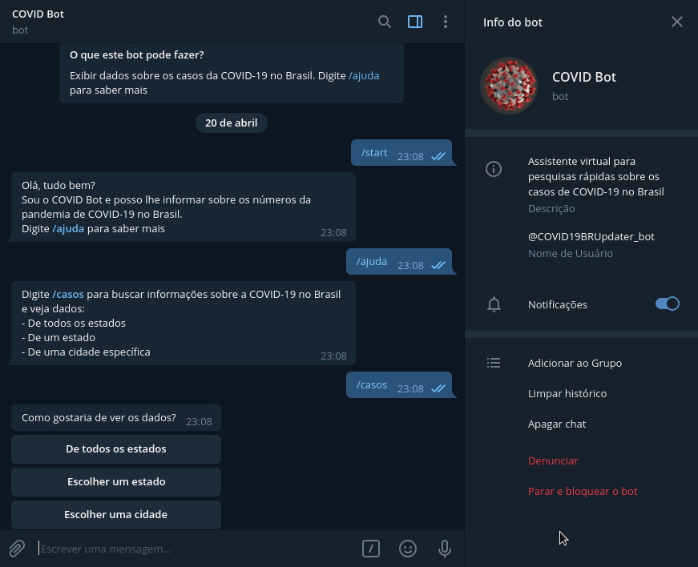
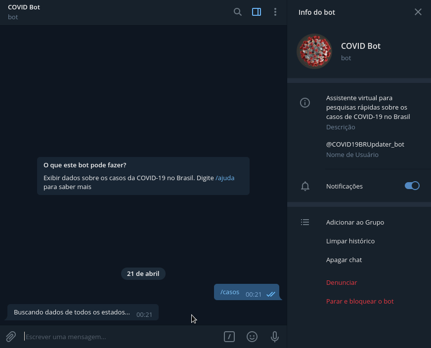
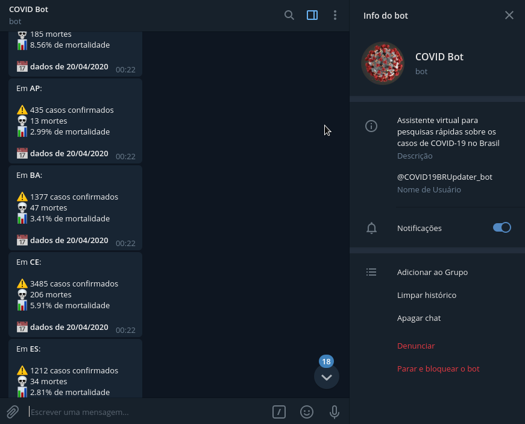
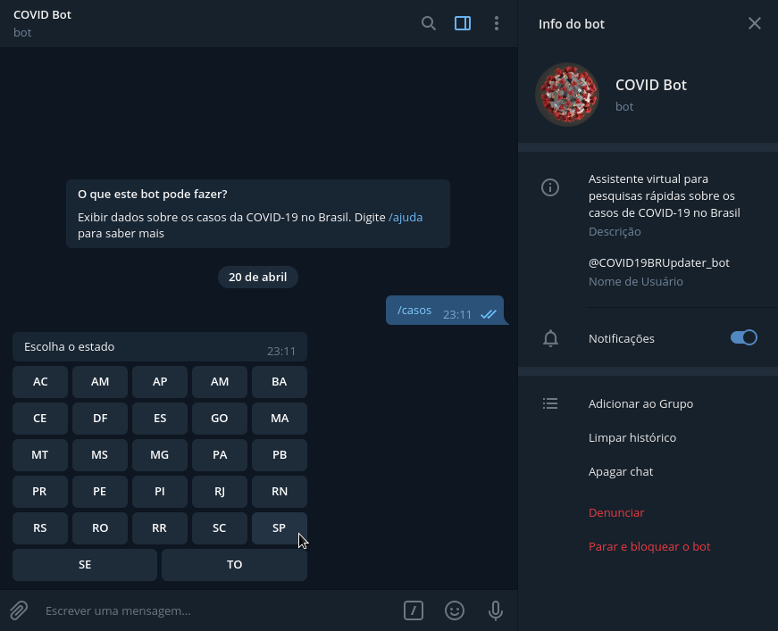
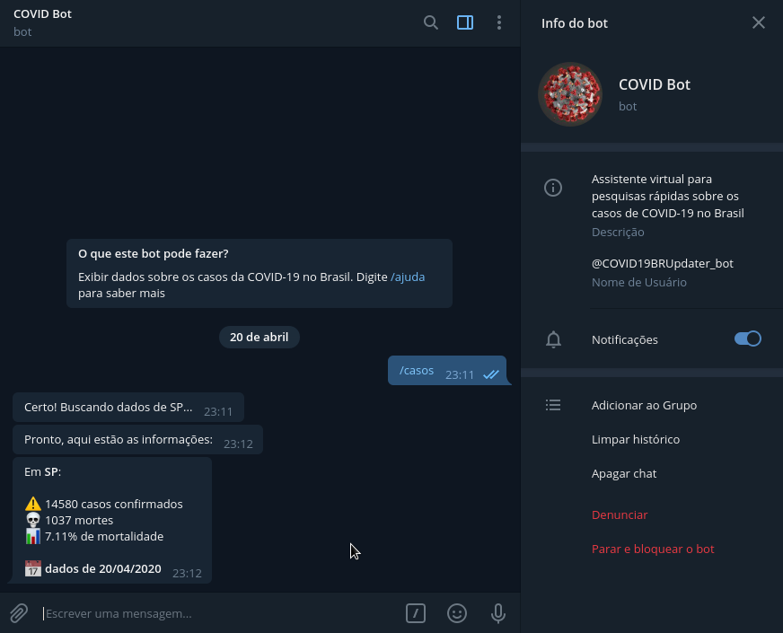
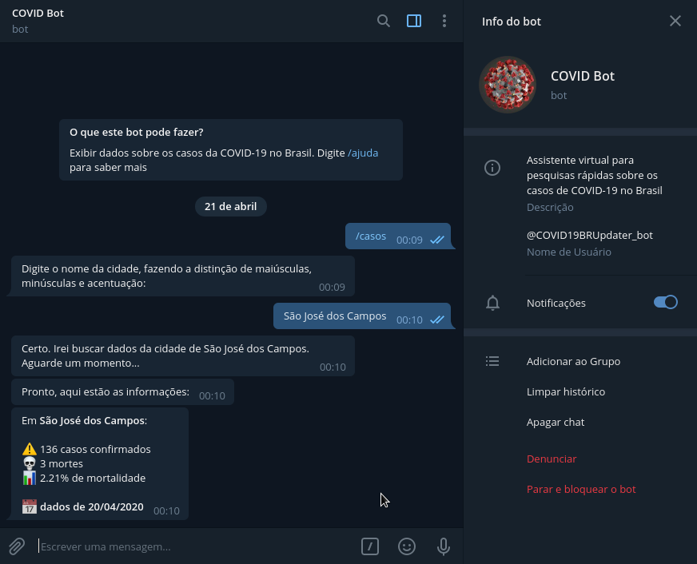

COVID Bot
=========

**Bot do Telegram para consulta rápida de casos sobre a COVID-19 no Brasil**

Consultando dados
------------------

    A consulta pode ser feita por:

>*Dados de todos os estados*

>*Dados de um estado*

>*Dados de uma cidade*

